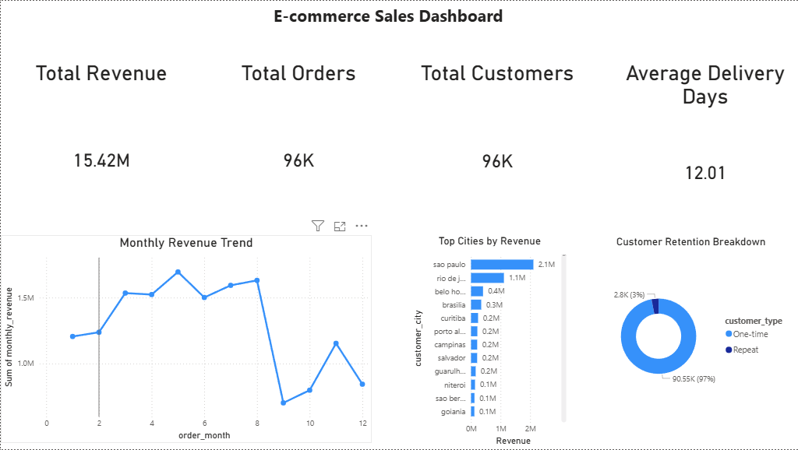
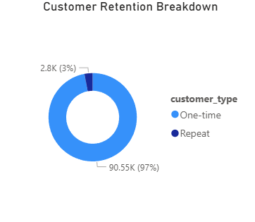
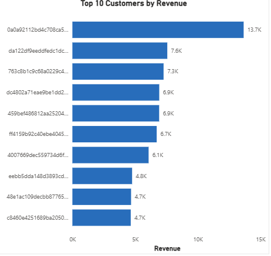
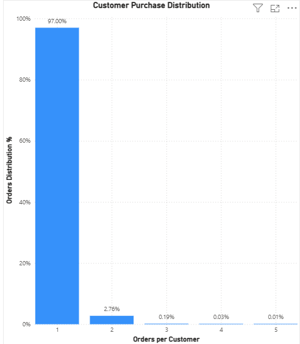

# 🛒 E-commerce Sales Intelligence Dashboard

## 🚀 Live Project Preview

---

## 📌 Project Overview

This project is an end-to-end data analytics solution designed to analyze e-commerce sales performance. It covers the full data lifecycle: from raw data processing and transformation to database storage and interactive dashboard visualization.

The objective is to extract actionable business insights such as revenue trends, customer behavior, geographic performance, and customer retention patterns.

---

## 🧰 Tech Stack

* **Python (Pandas, NumPy)** → Data processing & feature engineering  
* **PostgreSQL** → Data storage & querying  
* **SQL** → Data modeling, aggregation, and views  
* **Power BI** → Interactive dashboard & visualization  

---

## 🏗️ Architecture

Raw Data → Python Pipeline → Clean Dataset → PostgreSQL → SQL Views → Power BI Dashboard

---

## ⚙️ Data Pipeline

The pipeline processes raw datasets and produces a clean, analysis-ready dataset.

### Steps:

1. Load raw CSV datasets  
2. Clean and transform data  
3. Create new features:
   * Order total value  
   * Delivery time (days)  
   * Order month  
4. Filter relevant records (e.g., delivered orders)  
5. Merge datasets into a final dataset  

📂 Output:

```
data/cleaned/final_dataset.csv
```

---

## 🗄️ Database Layer (PostgreSQL)

### Main Table

* `ecommerce_orders`

### Database Structure

```
public ecommerce_orders
public ecommerce_kpis
public ecommerce_monthly_revenue
public ecommerce_top_cities
public ecommerce_customer_retention
public ecommerce_top_customers
public ecommerce_orders_distribution
```

---

## 🧾 SQL Views

### 📊 KPI View

```sql
CREATE VIEW ecommerce_kpis AS
SELECT
    ROUND(SUM(item_total_value)::numeric, 2) AS total_revenue,
    COUNT(DISTINCT order_id) AS total_orders,
    COUNT(DISTINCT customer_id) AS total_customers,
    ROUND(AVG(delivery_time_days)::numeric, 2) AS avg_delivery_days
FROM ecommerce_orders;
```

### 📈 Monthly Revenue

```sql
CREATE VIEW ecommerce_monthly_revenue AS
SELECT
    order_month,
    ROUND(SUM(item_total_value)::numeric, 2) AS monthly_revenue
FROM ecommerce_orders
GROUP BY order_month
ORDER BY order_month;
```

### 🌍 Top Cities

```sql
CREATE VIEW ecommerce_top_cities AS
SELECT
    customer_city,
    ROUND(SUM(item_total_value)::numeric, 2) AS revenue
FROM ecommerce_orders
GROUP BY customer_city
ORDER BY revenue DESC;
```

### 👥 Customer Retention

```sql
CREATE VIEW ecommerce_customer_retention AS
SELECT
    customer_unique_id,
    COUNT(DISTINCT order_id) AS total_orders,
    CASE 
        WHEN COUNT(DISTINCT order_id) = 1 THEN 'One-time'
        ELSE 'Repeat'
    END AS customer_type
FROM ecommerce_orders
GROUP BY customer_unique_id;
```

### 💰 Top Customers

```sql
CREATE VIEW ecommerce_top_customers AS
SELECT
    customer_unique_id,
    ROUND(SUM(item_total_value)::numeric, 2) AS total_spent,
    COUNT(DISTINCT order_id) AS total_orders
FROM ecommerce_orders
GROUP BY customer_unique_id
ORDER BY total_spent DESC;
```

### 📊 Orders Distribution

```sql
CREATE VIEW ecommerce_orders_distribution AS
SELECT
    total_orders,
    COUNT(*) AS customer_count
FROM (
    SELECT
        customer_unique_id,
        COUNT(DISTINCT order_id) AS total_orders
    FROM ecommerce_orders
    GROUP BY customer_unique_id
) t
GROUP BY total_orders
ORDER BY total_orders;
```

---

## 📊 Dashboard (Power BI)

### 🟦 Page 1: Executive Overview

* KPI Cards:
  * Total Revenue  
  * Total Orders  
  * Total Customers  
  * Average Delivery Time  

* Monthly Revenue Trend  
* Top Cities by Revenue  
* Customer Retention Breakdown  

---

### 🟩 Page 2: Customer Analysis

* Top 10 Customers by Revenue  
* Customer Purchase Distribution  

---

## 📸 Dashboard Preview

### Full Dashboard


### Monthly Revenue Trend


### Top Cities by Revenue


### Customer Retention


### Top Customers


### Customer Purchase Distribution


---

## 📈 Key Insights

* Revenue peaks during mid-year months (May–July)  
* Significant drop in revenue after month 8  
* São Paulo generates the highest revenue  
* ~97% of customers make only one purchase  
* Repeat customer rate is very low (~3%)  
* Revenue is concentrated among a small group of high-value customers  

---

## ⚠️ Challenges & Solutions

### 1. Power BI Not Detecting New Views
**Problem:**  
New SQL views were not automatically visible in Power BI  

**Solution:**  
Manually reconnected and added them via:
```
Transform Data → New Source → PostgreSQL
```

---

### 2. Dependency Errors in PostgreSQL
**Problem:**  
Could not drop tables due to dependent views  

**Solution:**  
Used:
```sql
DROP TABLE ecommerce_orders CASCADE;
```

---

### 3. Incorrect Aggregations in Power BI
**Problem:**  
Fields appeared as `Sum of ...` incorrectly  

**Solution:**  
Used:
* “Don’t summarize” for categorical fields  
* Correct aggregation for measures  

---

### 4. Skewed Distribution Visualization
**Problem:**  
Customer distribution chart was unreadable (most customers had 1 order)  

**Solution:**  
Created DAX measure:

```DAX
Orders Distribution % =
DIVIDE(
    SUM('public ecommerce_orders_distribution'[customer_count]),
    CALCULATE(
        SUM('public ecommerce_orders_distribution'[customer_count]),
        ALL('public ecommerce_orders_distribution')
    )
)
```

Converted results into percentage → clear insight

---

### 5. Visualization Clutter
**Problem:**  
Too many categories and long IDs made charts unreadable  

**Solution:**  
* Applied Top 10 filtering  
* Used tooltips for extra info  
* Simplified formatting  

---

## ▶️ How to Run

```bash
pip install -r requirements.txt
py -3.12 -m scripts.run_pipeline
py -3.12 -m scripts.load_to_postgres
```

Then:

1. Open PostgreSQL (`ecommerce_db`)  
2. Run SQL views from `sql/views.sql`  
3. Open Power BI and connect to PostgreSQL  
4. Load views and refresh dashboard  

---

## 📂 Project Structure

```
ecommerce-sales-intelligence/
│
├── data/
│   ├── raw/
│   └── cleaned/
│
├── notebooks/
│   └── ecommerce_analysis.ipynb
│
├── scripts/
│   ├── run_pipeline.py
│   └── load_to_postgres.py
│
├── sql/
│   └── views.sql
│
├── dashboard/
│   ├── sales_dashboard.png
│   ├── monthly_revenue.png
│   ├── top_cities.png
│   ├── costumer_retention.png
│   ├── top_customers.png
│   └── purchase_destribution.png
│
├── README.md
└── requirements.txt
```

---

## 🧠 What This Project Demonstrates

* End-to-end data pipeline design  
* Data cleaning and feature engineering  
* SQL data modeling and reusable views  
* Database integration (PostgreSQL)  
* Data visualization and storytelling  
* Cross-tool integration (Python → SQL → Power BI)  

---

## 🔮 Future Improvements

* Customer segmentation (RFM analysis)  
* Predictive modeling (customer lifetime value)  
* Real-time data pipeline  
* Power BI Service deployment  

---

## 👤 Author

**Alsedi Berdufi**