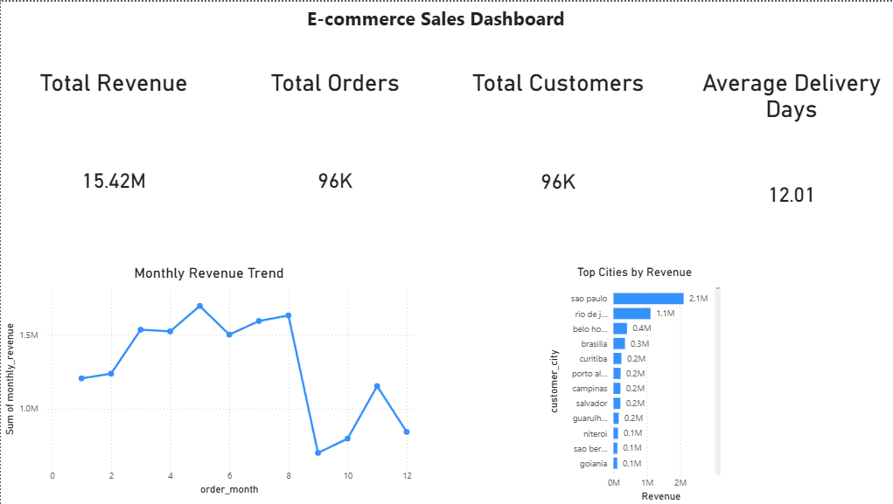
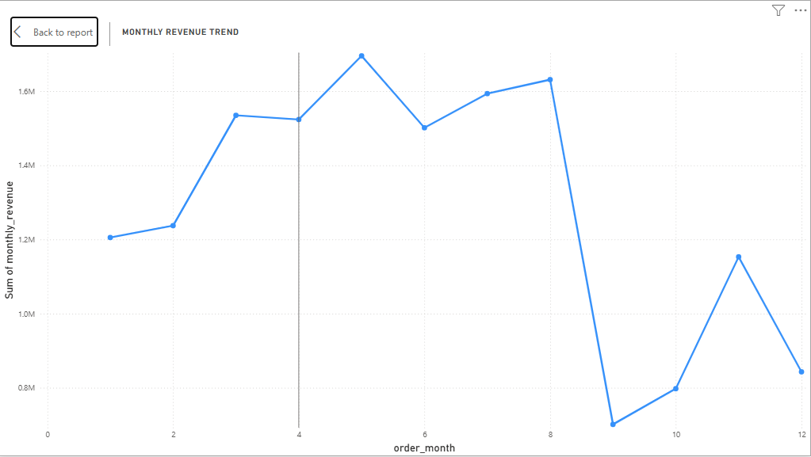
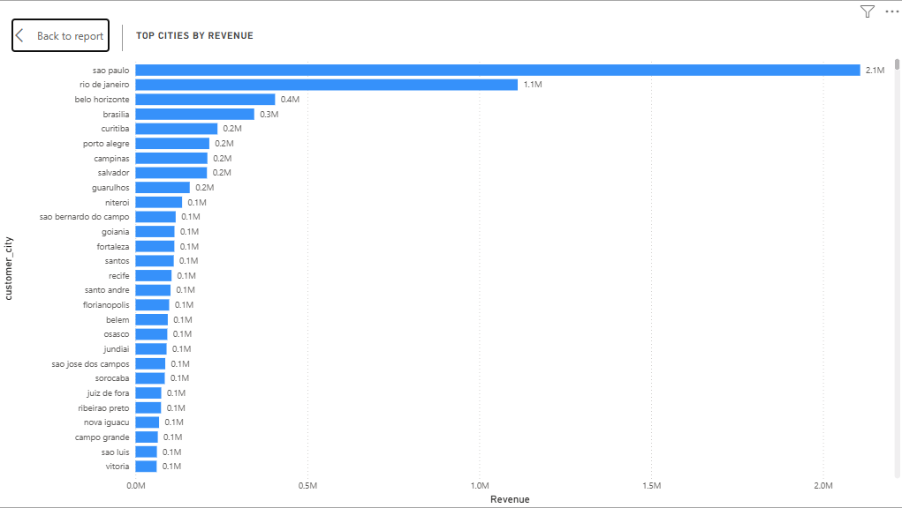

# 🛒 E-commerce Sales Intelligence Dashboard

## 📌 Project Overview

This project is an end-to-end data analytics solution built to analyze e-commerce sales performance. It covers the full data lifecycle: from raw data processing and transformation to database storage and interactive dashboard visualization.

The goal is to extract meaningful business insights such as revenue trends, customer behavior, and geographic performance.

---

## 🧰 Tech Stack

* **Python** (Pandas, NumPy) → Data processing & feature engineering
* **PostgreSQL** → Data storage & querying
* **SQL** → Data modeling, aggregation, and views
* **Power BI** → Interactive dashboard & visualization

---

## ⚙️ Data Pipeline

The pipeline processes raw datasets and produces a clean, analysis-ready dataset.

### Steps:

1. Load raw CSV datasets
2. Clean and transform data
3. Create new features:

   * Order total value
   * Delivery time (days)
   * Order month
4. Filter relevant records (e.g., delivered orders)
5. Merge datasets into a final dataset

📂 Output:

```
data/cleaned/final_dataset.csv
```

---

## 🗄️ Database Layer (PostgreSQL)

The cleaned dataset is loaded into PostgreSQL and structured for analysis.

### Main Table:

* `ecommerce_orders`

### SQL Views (Reusable Analytics Layer):

#### 📊 KPI View

```sql
CREATE VIEW ecommerce_kpis AS
SELECT
    ROUND(SUM(item_total_value)::numeric, 2) AS total_revenue,
    COUNT(DISTINCT order_id) AS total_orders,
    COUNT(DISTINCT customer_id) AS total_customers,
    ROUND(AVG(delivery_time_days)::numeric, 2) AS avg_delivery_days
FROM ecommerce_orders;
```

#### 📈 Monthly Revenue

```sql
CREATE VIEW ecommerce_monthly_revenue AS
SELECT
    order_month,
    ROUND(SUM(item_total_value)::numeric, 2) AS monthly_revenue
FROM ecommerce_orders
GROUP BY order_month
ORDER BY order_month;
```

#### 🌍 Top Cities

```sql
CREATE VIEW ecommerce_top_cities AS
SELECT
    customer_city,
    ROUND(SUM(item_total_value)::numeric, 2) AS revenue
FROM ecommerce_orders
GROUP BY customer_city;
```

---

## 📊 Dashboard (Power BI)

The dashboard connects directly to PostgreSQL and visualizes key metrics.

### Components:

#### 🔹 KPI Cards

* Total Revenue
* Total Orders
* Total Customers
* Average Delivery Time

#### 🔹 Revenue Trend

* Monthly revenue evolution

#### 🔹 Geographic Analysis

* Top cities by revenue

---

## 📸 Dashboard Preview

### Full Dashboard


### Monthly Revenue


### Top Cities



## 📈 Key Insights

* São Paulo is the dominant contributor to total revenue
* Sales peak during mid-year months
* Significant revenue drop after month 8
* Number of customers ≈ number of orders → low repeat purchase rate

---

## 🧠 What This Project Demonstrates

* End-to-end data pipeline design
* Data cleaning and feature engineering
* SQL data modeling and optimization
* Building reusable analytical layers (views)
* Data visualization and storytelling
* Integration between Python, SQL, and BI tools

---

## 🚀 How to Run the Project

### 1. Run the pipeline

```bash
python -m scripts.run_pipeline
```

### 2. Load data into PostgreSQL

* Import `final_dataset.csv` into `ecommerce_orders`

### 3. Run SQL scripts

```bash
sql/views.sql
```

### 4. Open Power BI

* Connect to PostgreSQL
* Load views
* Build dashboard

---

## 📂 Project Structure

```
ecommerce-sales-intelligence/
│
├── data/
│   ├── raw/
│   └── cleaned/
│
├── notebooks/
│   └── ecommerce_analysis.ipynb
│
├── scripts/
│   └── run_pipeline.py
│
├── sql/
│   └── views.sql
│
├── dashboard/
│   └── (Power BI screenshots)
│
├── README.md
└── requirements.txt
```

---

## 🔮 Future Improvements

* Add customer segmentation analysis
* Implement repeat customer / retention metrics
* Automate pipeline scheduling
* Deploy dashboard online (Power BI Service)
* Add real-time data ingestion

---

## 👤 Author

Alsedi Berdufi
